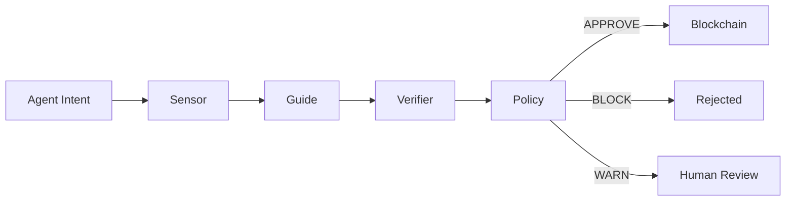

# Vigil — The Firewall for Autonomous AI Agents

**Vigil** is a real-time security harness for autonomous AI agents operating on the [Kite Network](https://gokite.ai). It intercepts every payment intent before execution, running it through a 4-stage security pipeline to block exploits, prompt injection attacks, and session drift.

> Built for the Kite AI Agent Hackathon 2026.

---

## The Problem

AI agents are being given wallets to perform autonomous tasks. But what happens when an agent gets prompt-injected, hallucinates a malicious recipient, or drifts from its authorized session intent? In April 2026 alone, **$606M was lost** to DeFi exploits — and agents have no built-in defense.

## The Solution

Vigil acts as an MCP-compatible intercept layer that sits between your agent and the blockchain. Before any payment executes, Vigil runs a 4-stage pipeline:

```
Agent Intent → [Sensor] → [Guide] → [Verifier] → [Policy] → Blockchain
```

| Stage | What it does |
|-------|-------------|
| **Sensor** | 16 deterministic rules: amount anomaly, blocklist, cross-chain keywords, session drift, IP geo, domain reputation, and more |
| **Guide** | DeepSeek LLM explains *why* a transaction is risky in plain language |
| **Verifier** | Confirms the LLM's reasoning is aligned with the sensor data |
| **Policy** | Makes the final APPROVE / WARN / BLOCK decision |

---

## Architecture

```
                  ┌─────────────────────────────────────┐
                  │       Vigil MCP Server (Node.js)     │
                  │                                      │
                  │   Sensor → Guide → Verifier → Policy │
                  │         → AgentRegistry.sol          │
                  │         → Supabase + SQLite          │
                  └──────┬──────────┬───────────────────┘
                         │          │
          ┌──────────────┼──────────┼──────────────────┐
          │              │          │                   │
     stdio (pipe)   REST API    Wallet Auth        MCP Tools
          │              │          │                   │
     Claude Code    Dashboard   MetaMask           Cursor IDE
     Terminal       Next.js     EIP-191 Nonce      VS Code
```

### Pipeline Flow

Every payment intent passes through 4 stages before reaching the blockchain:



### Data Flow

```
evaluate_payment()
        │
        ▼
  sensor.check() ───► 16 parallel rules
        │
        ▼
  guide.explain() ──► DeepSeek LLM analysis
        │
        ▼
  verifier.verify() ► Alignment check + retry
        │
        ▼
  policy.decide() ──► APPROVE / WARN / BLOCK
        │
        ├──► SQLite (local dev)
        ├──► Supabase (production)
        └──► AgentRegistry.sol (on-chain trust score)
```

---

## The 16-Rule Sensor Engine

| # | Rule | What it checks | Severity |
|---|------|---------------|----------|
| 1 | Amount Threshold | Payment exceeds 10 / 100 / 1000 tokens | MEDIUM → CRITICAL |
| 2 | Catalog Trust | Recipient not in Kite service catalog | HIGH |
| 3 | Rate Limiting | >10 transactions in 1 hour | MEDIUM → CRITICAL |
| 4 | Contract Risk | Recipient matches known exploit database | CRITICAL |
| 5 | Cross-Chain Risk | LayerZero core contracts / OFT keywords in URL | CRITICAL |
| 6 | Session Drift | Payment target mismatches session intent | HIGH |
| 6b | Context Anomaly | Session spending proximity, TTL, urgency | MEDIUM → HIGH |
| 7 | Behavioral Drift | Amount deviates >3σ from 7-day baseline | HIGH |
| 8 | Urgency Keywords | Social engineering terms in URL | MEDIUM → HIGH |
| 9 | Trust Tier | On-chain AgentRegistry reputation score | MEDIUM |
| 10 | Threat Intel | Real-time X/Twitter exploit mentions (Grok) | HIGH |
| 11 | Self-Payment | Agent paying its own address | CRITICAL |
| 12 | IP Geolocation | Server hosted in sanctioned jurisdiction | HIGH |
| 13 | Domain Reputation | URL matches phishing/scam blocklist | CRITICAL |
| 14 | TLS Certificate | Invalid or expired HTTPS certificate | HIGH |
| 15 | ERC20 Approvals | Unlimited token approval detected | HIGH |
| 16 | Oracle Integrity | Pre-payment price/APY sanity check | MEDIUM |

---

## Features

- 🛡️ **16-Rule Deterministic Engine** — zero latency, zero LLM dependency for blocking obvious attacks
- 🤖 **DeepSeek Intent Drift Detection** — catches semantic mismatches between agent task and payment target
- 🔁 **Autonomous Rule Composer** — runs every 24h, uses AI to propose new shadow rules based on recent exploits
- 🔐 **Wallet-Authenticated Dashboard** — private feed using cryptographic nonce signatures (EIP-191)
- ⛓️ **On-Chain Trust Registry** — `AgentRegistry.sol` records every action's risk level on Kite Testnet

---

## Tech Stack

| Layer | Technology |
|-------|-----------|
| Frontend | Next.js 14, RainbowKit, wagmi |
| Backend | Node.js, Express, MCP SDK |
| Database | Supabase (production), SQLite (local) |
| Smart Contract | Solidity, Foundry, Kite Testnet (chain ID 2368) |
| LLM | DeepSeek via OpenRouter |

---

## Quick Start

### Prerequisites
- Node.js >= 18
- A [Supabase](https://supabase.com) project
- An [OpenRouter](https://openrouter.ai) API key

### 1. Clone and install
```bash
git clone https://github.com/KamiliaNHayati/vigil.git
cd vigil
npm install
cd frontend && npm install && cd ..
```

### 2. Configure environment
```bash
cp .env.example .env
# Fill in SUPABASE_URL, SUPABASE_SERVICE_ROLE_KEY, OPENROUTER_KEY
```

Also create `frontend/.env.local`:
```
NEXT_PUBLIC_VIGIL_API=http://localhost:3001
```

### 3. Seed demo data
```bash
npm run seed
```

### 4. Start the backend
```bash
npm run start:rest
```

### 5. Start the frontend
```bash
cd frontend && npm run dev
```

Open [http://localhost:3000](http://localhost:3000).

---

## Running the Demo

### Safe path (Weather API agent)
```bash
node demo-agent/index.js
```

### Attack path (prompt injection → cross-chain drain)
```bash
node demo-agent/index.js --attack
```

### Reset and re-seed for a clean demo
```bash
npm run demo:reset
npm run seed
```

---

## Smart Contracts

Deployed on Kite Testnet (chain ID: 2368):

| Contract | Address |
|----------|---------|
| `AgentRegistry.sol` | `0xB41227F66f7963A902af16Ec41eC803198B09068` |

---

## API Reference

| Method | Endpoint | Description |
|--------|----------|-------------|
| `POST` | `/api/evaluate` | Evaluate a payment intent |
| `POST` | `/api/record` | Record a payment outcome |
| `GET` | `/api/evaluations` | Public dashboard feed |
| `GET` | `/api/evaluations/:address` | Authenticated agent feed |
| `GET` | `/api/auth/nonce/:address` | Get wallet auth nonce |
| `GET` | `/api/reputation/:address` | Agent trust score |
| `POST` | `/api/compose-rule` | Trigger Rule Composer manually |
| `GET` | `/api/health` | Server health check |

---

## License

MIT
