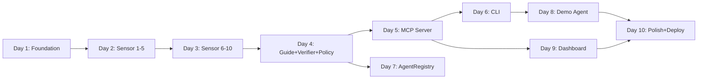

# Vigil: 10-Day Build Plan — Deliverables 1–3

> **Deadline:** May 17, 2026 (buffer through May 11 target)
> **Solo developer** · Node.js 18+ · Kite testnet · SQLite in-process · ~$0.15 LLM budget

---

## DELIVERABLE 1: Day-by-Day Build Schedule (May 2–11)

| Day | Date | Theme | Tasks | Deliverables (Done by EOD) | Cut If Behind |
|-----|------|-------|-------|---------------------------|---------------|
| **1** | May 2 | **Foundation + Store** | 1. `npm init`, install deps (`ethers`, `better-sqlite3`, `chalk`, `commander`, `express`, `@modelcontextprotocol/sdk`) · 2. Create full repo scaffold (Architecture.md §7) · 3. Implement `store.js` — SQLite schema (actions, session_intents, indexes) · 4. Implement `llm-client.js` — `callOpenRouter`, `rawCall`, `checkThreatIntel`, `MODELS` · 5. Create `.env` from Architecture.md §6 · 6. Create `data/known-services-fallback.json` + `data/service-trust-scores.json` + `data/exploit-db.json` | Repo scaffold matches §7 · `store.js` creates DB, CRUD works · `llm-client.js` calls OpenRouter successfully · `.env` populated with all Kite testnet addresses | Drop `checkThreatIntel` (Grok) — hardcode `{threatsFound: false}` |
| **2** | May 3 | **Sensor Core (Rules 1–5)** | 1. Implement `sensor.js` skeleton with `check()` · 2. Rule 1: Amount thresholds (18-decimal BigInt) · 3. Rule 2: `kite-mcp-bridge.js` — catalog client with static fallback · 4. Rule 3: Rate limiting from SQLite · 5. Rule 4: `contract-risk.js` — exploit DB + source verification mock · 6. Rule 5: `crosschain-risk.js` — LZ contract blocklist + OFT check + URL keywords | `sensor.check()` returns flags for amount/catalog/rate/contract/crosschain · Unit-testable with hardcoded intents · All LZ addresses from Rules.md §7.3 in blocklist | Drop OFT ERC-165 detection — use hardcoded set only |
| **3** | May 4 | **Sensor Advanced (Rules 6–10)** | 1. Rule 6: `session-drift.js` — keyword overlap + LLM semantic check · 2. Rule 6b: `context-anomaly.js` — session spending proximity, TTL, urgency keywords · 3. Rule 7: `behavioral-drift.js` — 3σ statistical detection · 4. Rule 8: Urgency keywords in URL (already in sensor.js) · 5. Rule 9: On-chain trust tier via AgentRegistry ABI · 6. Rule 10: Threat intel via Grok (already in llm-client.js) · 7. Wire all 10 rules into `sensor.js` `check()` | `sensor.check()` fires all 10 rules · Session drift detects "DeFi yield" vs "layerzero-relay" · Behavioral drift flags 500 tokens with seeded baseline | Drop context-anomaly.js (Rule 6b) — it depends on `kpass` CLI being available |
| **4** | May 5 | **Sensor Security Patch + Guide + Verifier + Policy** | **Morning (60–90 min):** Add GLM security patches to sensor.js (payTo mismatch, duplicate, rolling spend, self-payment, typosquatting) + context-anomaly.js (first-action anomaly). Re-run tests. **Afternoon:** 1. Implement `guide.js` — `explain()` + degraded fallback + `explainWithCorrection()` + `sanitizeForLLM()`. 2. Implement `verifier.js` — alignment checks + retry loop. 3. Implement `policy.js` — decision table + vault budget check + degraded mode strict + circuit breaker. | Guide returns structured JSON with sanitized inputs · Verifier catches missing WARNING/false-safety · Policy returns APPROVE/WARN/BLOCK with correct codes · Degraded mode blocks MEDIUM+ · Circuit breaker operational · All 14 sensor rules fire correctly |
| **5** | May 6 | **MCP Server + REST** | 1. Implement `mcp-server.js` — `handleEvaluatePayment`, `handleRecordOutcome`, `handleGetReputation` · 2. Wire stdio transport (for demo agent) · 3. Wire REST transport (for CLI + dashboard) · 4. Add `checkOracleSanity()` in `record_outcome` · 5. Add CORS for dashboard · 6. Test: `curl POST /api/evaluate` with safe + attack payloads | REST server on :3003 returns full response shape (Rules.md §13) · `record_outcome` stores to SQLite + returns oracle warnings · stdio transport connects and responds | Drop HTTP + SSE transports — ship stdio + REST only (2 of 4) |
| **6** | May 7 | **CLI Tool + Seed Data** | 1. Implement `bin/vigil.js` — `evaluate` command with color-coded output · 2. Implement `vigil reputation` command · 3. Interactive WARN flow (readline confirmation) · 4. Exit code 1 on BLOCK · 5. `scripts/seed-demo-data.js` — 10 synthetic actions at 0.5–1.5 tokens · 6. `service-trust.js` — trust score lookup for dashboard | `vigil evaluate --pay-to ... --amount ... --resource ... --agent ...` works · GREEN/YELLOW/RED output · BLOCK exits 1 · Seed data creates behavioral baseline | Drop `vigil reputation` — judges won't use it |
| **7** | May 8 | **AgentRegistry.sol Deploy** | 1. Write `contracts/AgentRegistry.sol` (from Architecture.md §3.15) · 2. Write `contracts/deploy.js` — deploy with reporter address · 3. Deploy to Kite testnet via ethers.js · 4. Update `.env` with deployed address · 5. Uncomment on-chain write in `mcp-server.js` `handleRecordOutcome` · 6. Verify: `getTrustTier()` and `getProfile()` return data | AgentRegistry live on Kite testnet · `recordAction` stores traceHash · `getTrustTier` returns correct tier · Sensor rule 9 reads real on-chain data | If deployment fails: keep contract code, use mock provider that returns tier=1 for all agents |
| **8** | May 9 | **Demo Agent + Attack Script** | 1. Implement `demo-agent/index.js` — x402 discovery flow · 2. Safe path: discover weather API → evaluate → approve → execute → record · 3. Attack path: `--attack` flag → 500 token drain to malicious relay · 4. `scripts/demo.sh` — orchestrated 60-second demo script · 5. Test full loop: safe → APPROVE, attack → BLOCK at all 4 gaps | Demo agent runs end-to-end · Safe path: GREEN APPROVE in <3s · Attack path: RED BLOCK with 4+ flags · `demo.sh` automates both paths | If kpass CLI unavailable: mock `kpassExecute` to return canned response |
| **9** | May 10 | **Dashboard (Next.js)** | 1. `npx -y create-next-app@latest frontend/` (App Router, no Tailwind) · 2. Evaluation feed: table with timestamp, agent, amount, risk badge, action, flags · 3. Auto-refresh: `useSWR` with 5s interval polling REST `/api/evaluations` · 4. Color-coded risk badges (LOW=green, MEDIUM=yellow, HIGH=orange, CRITICAL=red) · 5. Oracle warning ⚠️ column · 6. Service trust score column | Dashboard at localhost:3000 · Feed shows seeded + live evaluations · Auto-refreshes every 5s · Risk badges render correctly · Oracle warnings visible | Drop reputation lookup page — keep single-page feed only |
| **10** | May 11 | **Polish + README + Deploy** | 1. Deploy dashboard to Vercel · 2. Write README.md — install, demo, architecture overview, 60-second judge walkthrough · 3. Add `/api/evaluations` endpoint to REST server (returns SQLite log for dashboard) · 4. End-to-end test: seed → demo:safe → demo:attack → dashboard shows both · 5. Record demo GIF/video · 6. Final `.env.example` | Dashboard live on Vercel · README follows 60-second judge flow · Full demo runs without errors · All success criteria from PRD §10 verified | Drop Vercel deploy — localhost demo with screenshots |

> **Buffer: May 12–17** — Bug fixes, README polish, video recording, submission prep.

---

## DELIVERABLE 2: Progress Tracking Checklist

| # | Feature/Component | Priority | Status | Owner | Est. Hours | Dependencies | Verification Criteria |
|---|-------------------|----------|--------|-------|------------|--------------|----------------------|
| 1 | **Project scaffold + package.json** | P0 | Not Started | Solo Dev | 1h | None | `npm install` succeeds, repo matches Architecture.md §7 |
| 2 | **SQLite Local Store** (`store.js`) | P0 | Not Started | Solo Dev | 2h | #1 | `storeSessionIntent`, `getRecentActions`, `getAgentBaseline`, `getSessionSpending` all return correct data |
| 3 | **LLM Client** (`llm-client.js`) | P0 | Not Started | Solo Dev | 2h | #1 | `callOpenRouter` returns parsed JSON from DeepSeek · `rawCall` returns JSON · `checkThreatIntel` returns `{threatsFound}` |
| 4 | **Static Data Files** (fallback JSON, exploit-db, trust scores) | P0 | Not Started | Solo Dev | 1h | #1 | All 3 JSON files load without parse errors · Fallback has 4+ Kite services |
| 5 | **Sensor — Amount Thresholds** (Rule 1) | P0 | Not Started | Solo Dev | 1h | #1 | 1 token→LOW, 50→MEDIUM, 500→HIGH, 1500→CRITICAL |
| 6 | **Sensor — Catalog Recipient** (Rule 2) | P0 | Not Started | Solo Dev | 2h | #4 | Known payTo→no flag · Unknown payTo→HIGH · Catalog down→MEDIUM |
| 7 | **Kite MCP Bridge** (`kite-mcp-bridge.js`) | P0 | Not Started | Solo Dev | 2h | #4 | `catalogClient.listServices()` returns fallback when Kite MCP unavailable |
| 8 | **Sensor — Rate Limiting** (Rule 3) | P0 | Not Started | Solo Dev | 1h | #2 | 5 txs→no flag · 15→MEDIUM · 25→HIGH · 55→CRITICAL |
| 9 | **Contract Risk** (`contract-risk.js`) | P0 | Not Started | Solo Dev | 2h | #1 | EOA→skip · Exploited→CRITICAL · Unverified→HIGH · Trusted→pass |
| 10 | **Cross-Chain Risk** (`crosschain-risk.js`) | P1 | Not Started | Solo Dev | 2h | #1 | LZ EndpointV2→CRITICAL · Unknown OFT→HIGH · URL keyword→MEDIUM |
| 11 | **Session Intent Drift** (`session-drift.js`) | P0 | Not Started | Solo Dev | 3h | #2, #3 | "DeFi yield" session + "layerzero-relay" resource → HIGH drift flag |
| 12 | **Behavioral Drift** (`behavioral-drift.js`) | P1 | Not Started | Solo Dev | 2h | #2 | 500 tokens with baseline 0.5–1.5 → MEDIUM flag with >100σ |
| 13 | **Context Anomaly** (`context-anomaly.js`) | P1 | Not Started | Solo Dev | 2h | #2 | >80% per-tx limit→MEDIUM · TTL<5min→MEDIUM · Urgency keywords→MEDIUM |
| 14 | **Sensor Integration** (`sensor.js` full) | P0 | Not Started | Solo Dev | 2h | #5–#13 | `check()` returns correct `level` + `flags` array for safe + attack intents |
| 15 | **Guide Engine** (`guide.js`) | P0 | Not Started | Solo Dev | 3h | #3 | Returns structured JSON · Degraded mode returns synthetic explanation · `explainWithCorrection` retries |
| 16 | **Verifier Loop** (`verifier.js`) | P0 | Not Started | Solo Dev | 2h | #15 | Catches missing WARNING · Catches false-safety terms → hallucination fast-path · Retries once |
| 17 | **Policy Enforcer** (`policy.js`) | P0 | Not Started | Solo Dev | 2h | #14, #16 | Decision table matches Rules.md §4.1 exactly · Degraded mode blocks MEDIUM+ |
| 18 | **MCP Server** (`mcp-server.js`) | P0 | Not Started | Solo Dev | 4h | #14–#17 | stdio + REST transports work · `evaluate_payment` returns full response shape · `record_outcome` stores + returns oracle warning |
| 19 | **Oracle Sanity Hook** | P1 | Not Started | Solo Dev | 1h | #18 | `apy>50`→warning · Price deviation>20%→warning · <50 bytes→warning |
| 20 | **CLI Tool** (`bin/vigil.js`) | P0 | Not Started | Solo Dev | 3h | #18 | `vigil evaluate` shows GREEN/YELLOW/RED · BLOCK exits 1 · WARN prompts confirmation |
| 21 | **AgentRegistry.sol** | P1 | Not Started | Solo Dev | 4h | #1 | Deployed on Kite testnet · `recordAction` stores traceHash · `getTrustTier` returns tiers 0–3 |
| 22 | **Seed Demo Data** (`seed-demo-data.js`) | P0 | Not Started | Solo Dev | 1h | #2 | 10 actions seeded at 0.5–1.5 tokens · Session intent stored for demo |
| 23 | **Demo Agent** (`demo-agent/index.js`) | P1 | Not Started | Solo Dev | 4h | #18, #22 | Safe path: APPROVE <3s · Attack path: BLOCK with 4+ flags · No crash |
| 24 | **Service Trust Module** (`service-trust.js`) | P1 | Not Started | Solo Dev | 1h | #4 | `getServiceTrustScore('x402.dev.gokite.ai')` returns `{score: 95, tier: 'verified'}` |
| 25 | **Dashboard (Next.js)** | P0 | Not Started | Solo Dev | 8h | #18 | Evaluation feed renders · Auto-refresh 5s · Risk badges color-coded · Oracle ⚠️ shown |
| 26 | **Dashboard Deploy (Vercel)** | P0 | Not Started | Solo Dev | 2h | #25 | Public URL loads · Feed auto-updates |
| 27 | **README + Demo Script** | P0 | Not Started | Solo Dev | 3h | All | Judge follows full loop in 60s · Install instructions work · Demo script runs |
| 28 | **Demo Script** (`scripts/demo.sh`) | P1 | Not Started | Solo Dev | 2h | #23 | Runs safe + attack paths · Output matches Architecture.md §9 narrative |

> **Total estimated: ~65 hours across 10 days (~6.5h/day)**

---

## DELIVERABLE 3: Risk/Mitigation Table

| # | Risk | Likelihood | Impact | Mitigation | Contingency |
|---|------|-----------|--------|------------|-------------|
| 1 | **Kite MCP `discover_services` not live** | High | Medium | Already designed with static fallback (`known-services-fallback.json`). Fallback is the **primary** demo path. | Ship with fallback only. README explains: "same validation logic, zero code changes when live." |
| 2 | **OpenRouter API downtime / credit exhaustion** | Medium | High | Degraded mode (P0) auto-blocks MEDIUM+. Budget ~$0.15 = ~100 calls. Test degraded mode explicitly on Day 4. | Set `OPENROUTER_KEY=invalid` to force degraded mode for entire demo. Still demonstrates core value. |
| 3 | **AgentRegistry.sol deployment fails** (compile error, gas issues, RPC timeout) | Medium | Medium | Write deploy script with retry logic. Test compilation locally first with Hardhat/solc. | Mock the registry: `getTrustTier()` returns 1 for all agents. Contract code in repo proves architecture. Remove on-chain write from `record_outcome`. |
| 4 | **kpass CLI not installed / not authenticated** | High | High | Demo agent already wraps `kpassExecute` in try/catch. Fallback: canned x402 response data from Architecture.md §13.1. | Run demo without real x402 payments. Use pre-captured 402 response. Demo script simulates the flow with canned data + Vigil evaluation is real. |
| 5 | **Next.js dashboard scope creep** | High | High | Hard constraint: **single page only** (evaluation feed). No routing, no reputation page, no settings. Use vanilla CSS, not Tailwind. | Day 9 EOD checkpoint: if dashboard incomplete, ship CLI + REST API screenshots instead. CLI already satisfies "Functional UI" criterion. |
| 6 | **MCP SDK API changes** (`server.tool()` vs `server.registerTool()`) | Medium | Medium | Architecture.md specifies `registerTool()` for v2. Check `@modelcontextprotocol/sdk` changelog on install. | If API differs: use REST-only mode. Skip MCP stdio transport. REST wrapper calls same handlers directly. |
| 7 | **better-sqlite3 native build fails on Windows** | Medium | Medium | Use `npm install better-sqlite3` with prebuild binaries (default). Node 18+ on Windows has prebuilt support. | Switch to `sql.js` (pure JS SQLite). Same API surface, zero native deps. ~30 min migration. |
| 8 | **LLM returns malformed JSON** (DeepSeek schema violation) | High | Low | `guide.js` already has `try/catch` around `JSON.parse`. Fallback: slice first 300 chars as `explanation`, use sensor level as `riskLevel`. | Verifier catches misalignment → retry → if still bad → Policy blocks. System is designed for LLM unreliability. |
| 9 | **Behavioral drift math edge cases** (stdDev=0, no history) | Low | Low | `checkBehavioralDrift` already skips if <5 history items. Division by zero guard: `stdDev > 0 ? ... : 0`. | Return `null` (no flag) for any math error. Behavioral drift is P1 — safe to degrade. |
| 10 | **Vercel free tier cold start >5s** | Medium | Low | Dashboard is static-ish (polls REST API). No serverless functions needed if REST server runs on Railway/Render. | Host dashboard as static export with `next export`. Poll REST server hosted separately on Railway free tier. |
| 11 | **Demo runs over 60 seconds** | Medium | High | Script `demo.sh` is pre-timed. Pre-seed all data. Avoid live `kpass` calls (slow). Use REST API calls with `curl`. | Record demo video offline. Submit video link + live dashboard URL. Judges don't need to run it themselves. |
| 12 | **Cross-chain risk false positives** (legitimate bridge service flagged) | Low | Low | `TRUSTED_CROSSCHAIN_SERVICES` set includes `bridge.prod.gokite.ai`. Trusted services bypass LZ checks. | Add service to trusted set in static fallback. URL keyword check is MEDIUM (not CRITICAL), so won't block trusted services alone. |

---

## Proposed Execution Strategy

> [!IMPORTANT]
> **Days 1–4 are non-negotiable P0 foundation.** If Day 4 doesn't end with sensor→guide→verifier→policy producing correct APPROVE/BLOCK for safe and attack intents, everything downstream is at risk. Treat Day 4 as the first hard checkpoint.

> [!TIP]
> **Parallel testing approach:** After each day, run the two canonical test intents:
> - **Safe:** 1 token to `0x4A50DCA63d541372ad36E5A36F1D542d51164F19` for `https://x402.dev.gokite.ai/api/yield` → expect APPROVE
> - **Attack:** 500 tokens to `0xMalicious...` for `https://lz-arb.io/layerzero-relay/drain` → expect BLOCK with 4+ flags

### Critical Path



### P0 vs P1 Triage Rule

If any day slips, immediately cut **all P1 items** for that day:
- Day 2: Drop OFT ERC-165 detection
- Day 3: Drop context-anomaly.js, threat intel (Grok)
- Day 5: Drop HTTP + SSE transports (ship stdio + REST only)
- Day 7: Drop AgentRegistry entirely — mock it
- Day 9: Drop reputation page, oracle warning column

The irreducible demo is: **sensor + guide + verifier + policy + REST API + CLI + evaluation feed dashboard**. Everything else is gravy.

---

## Verification Plan

### Automated Tests (run after each day)
```bash
# Safe intent
curl -X POST http://localhost:3003/api/evaluate \
  -H "Content-Type: application/json" \
  -d '{"payTo":"0x4A50DCA63d541372ad36E5A36F1D542d51164F19","amountWei":"1000000000000000000","resource":"https://x402.dev.gokite.ai/api/yield","agentAddress":"0x1234567890123456789012345678901234567890"}'
# Expect: {"action":"APPROVE","sensorLevel":"LOW",...}

# Attack intent
curl -X POST http://localhost:3003/api/evaluate \
  -H "Content-Type: application/json" \
  -d '{"payTo":"0xDeaDbEeFDeaDbEeFDeaDbEeFDeaDbEeFDeaDbEeF","amountWei":"500000000000000000000","resource":"https://lz-arb.io/layerzero-relay/drain","agentAddress":"0x1234567890123456789012345678901234567890","sessionId":"sess_demo"}'
# Expect: {"action":"BLOCK","sensorLevel":"CRITICAL","flags":[...4+ flags]}

# CLI
vigil evaluate --pay-to 0xDeaDbEeF... --amount 500 --resource https://malicious.io/drain --agent 0x1234...
# Expect: exit code 1, RED [BLOCK] output
```

### Manual Verification
- Dashboard at Vercel URL auto-refreshes and shows both evaluations
- Judge walkthrough: README → install → seed → demo:safe → demo:attack → dashboard → 60 seconds
